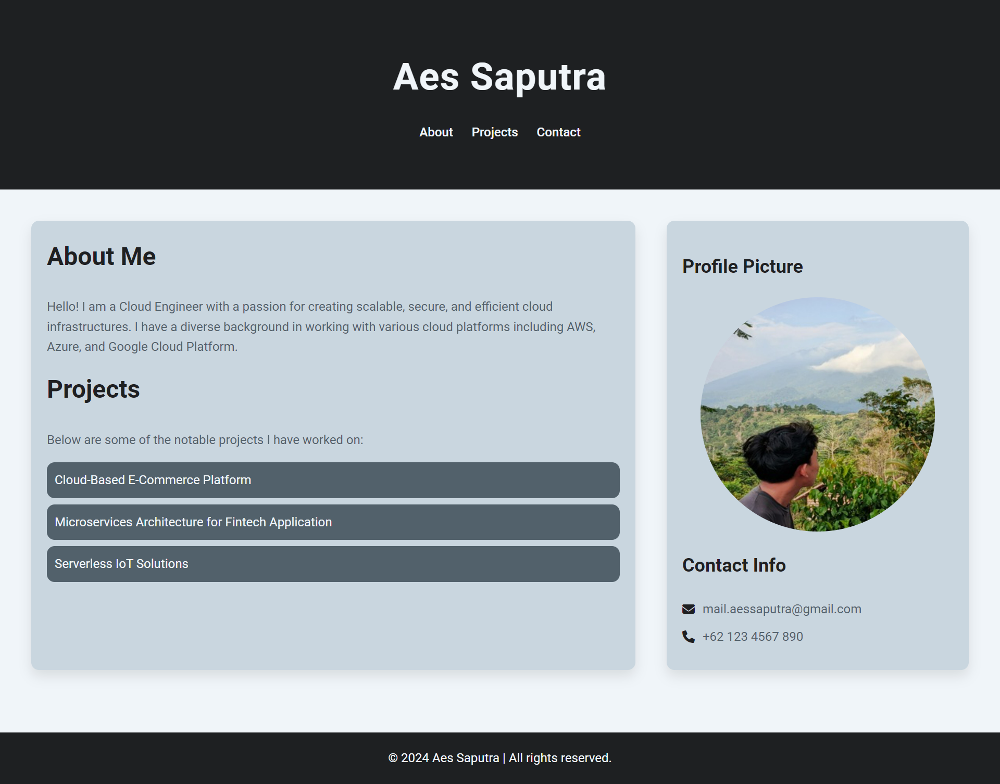

# Tugas Akhir Dicoding

Ini adalah project tugas akhir yang diselesaikan sebagai bagian dari program pembelajaran Dicoding. Project ini terdiri dari sebuah halaman web statis yang menggunakan HTML, CSS, dan gambar.

## Struktur Project

- `index.html`: File utama yang berisi struktur halaman web.
- `css/`: Folder yang berisi file CSS untuk gaya halaman web.
- `img/`: Folder yang berisi gambar yang digunakan dalam halaman.

## Cara Menjalankan

1. Clone repositori ini atau unduh file ZIP.
2. Ekstrak semua file.
3. Buka file `index.html` di peramban web untuk melihat tampilan halaman.

## Teknologi yang Digunakan

- **HTML**: Untuk struktur halaman.
- **CSS**: Untuk desain dan layout.
- **Gambar**: Berbagai gambar yang digunakan dalam halaman.
